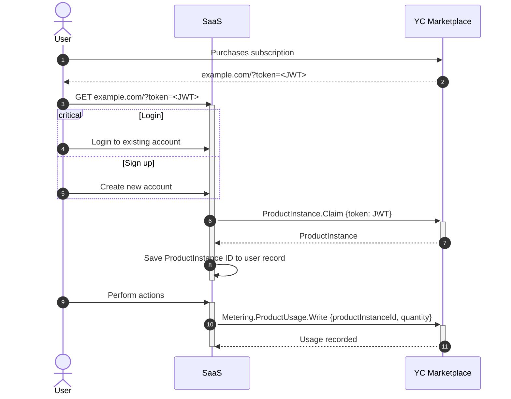

# Yandex Cloud Marketplace PIM Demo (Go)

This is a demonstration application showing how to integrate a SaaS application with Yandex Cloud Marketplace for product instance management and usage metering.

## What This Demo Does

This application demonstrates:

1. User registration and authentication
2. Binding a user account to a Yandex Cloud Marketplace product instance using a token
3. Reporting usage metrics to Yandex Cloud Metering service

The demo implements a simple web application where users can:
- Register and login
- Bind their account to a Yandex Cloud product instance
- Report usage of the product to Yandex Cloud Metering service

## Prerequisites

- [Go](https://golang.org/dl/) 1.23 or later
- [YDB](https://ydb.tech/) database instance
- Yandex Cloud account with access to Marketplace services
- Service account key file (optional, if not running on Yandex Cloud VM)

## Environment Variables

The application requires the following environment variables:

- `YDB_CONNECTION_STRING`: Connection string for your YDB database
- `YC_SA_KEY_FILE`: Path to your service account key file (optional, if not running on Yandex Cloud VM)
- `PORT`: Port to run the web server on (defaults to 8080)

## Installation

1. Clone the repository
2. Navigate to the `pim/demo/go` directory
3. Install dependencies:

```bash
go mod download
```

## Database Setup

Before running the application, you need to set up the database tables:

```bash
go run cmd/migrate/main.go
```

This will create the necessary tables in your YDB database.

## Running the Application

To run the application:

```bash
go run main.go user.go
```

The application will start a web server on the specified port (default: 8080).

## Usage

1. Open your browser and navigate to `http://localhost:8080`
2. Register a new user account
3. Log in with your credentials
4. To bind a product instance, you need a token from Yandex Cloud Marketplace
   - Add the token to the URL as a query parameter: `http://localhost:8080/?token=your-token`
   - Click the "Bind" button to associate your account with the product instance
5. Once bound, you can report usage metrics by entering an amount and clicking "Report Usage"

## Integration Flow

The following sequence diagram illustrates the integration flow between the user, the SaaS application, and Yandex Cloud Marketplace:



## Development Notes

- The application uses [Chi](https://github.com/go-chi/chi) for HTTP routing
- User passwords are hashed using bcrypt
- Session management is implemented using cookies
- The application interacts with Yandex Cloud APIs to:
  - Claim product instances
  - Report usage metrics
- The SKU ID for usage reporting is hardcoded in the demo (see `reportPostHandler` in `user.go`)

## Project Structure

- `main.go`: Application entry point and server setup
- `user.go`: HTTP handlers and business logic
- `cmd/migrate`: Database migration utility
- `pkg/db`: Database access layer
- `templates`: HTML templates for the web interface
