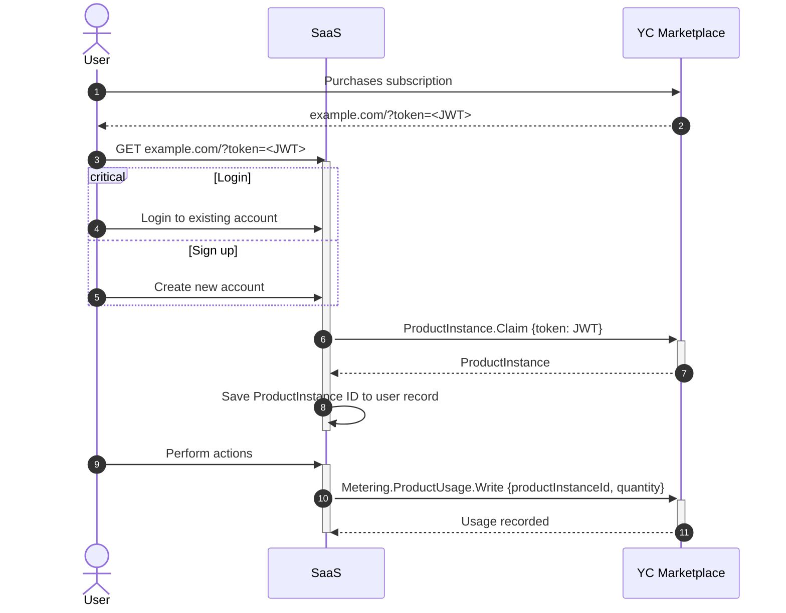

# Yandex Cloud Marketplace PIM Demo (Python)

This is a demonstration application showing how to integrate a SaaS application with Yandex Cloud Marketplace for product instance management and usage metering.

## What This Demo Does

This application demonstrates:

1. User registration and authentication
2. Binding a user account to a Yandex Cloud Marketplace product instance using a token
3. Reporting usage metrics to Yandex Cloud Metering service

The demo implements a simple web application where users can:
- Register and login
- Bind their account to a Yandex Cloud product instance
- Report usage of the product to Yandex Cloud Metering service

## Prerequisites

- [Python](https://www.python.org/downloads/) 3.10 or later
- [YDB](https://ydb.tech/) database instance
- Yandex Cloud account with access to Marketplace services
- Service account key file (for authentication with Yandex Cloud)

## Environment Variables

The application requires the following environment variables:

- `YDB_ENDPOINT`: Endpoint for your YDB database
- `YDB_DATABASE`: Name of your YDB database
- `PORT`: Port to run the web server on (defaults to 8080)

## Installation

1. Clone the repository
2. Navigate to the `pim/demo/python` directory
3. Create and activate a virtual environment:

```bash
python -m venv venv
source venv/bin/activate  # On Windows: venv\Scripts\activate
```

4. Install dependencies:

```bash
pip install -r requirements.txt
```

## Database Setup

The database tables are created automatically when the application starts for the first time. The `db.py` file contains a `create_tables()` function that sets up the necessary tables in your YDB database.

No manual setup is required, but you can examine the `db.py` file to see how the tables are defined.

## Running the Application

To run the application:

```bash
python main.py
```

The application will start a web server on the specified port (default: 8080).

## Usage

1. Open your browser and navigate to `http://localhost:8080`
2. Register a new user account
3. Log in with your credentials
4. To bind a product instance, you need a token from Yandex Cloud Marketplace
   - Add the token to the URL as a query parameter: `http://localhost:8080/?token=your-token`
   - Click the "Bind" button to associate your account with the product instance
5. Once bound, you can report usage metrics by entering an amount and clicking "Report Usage"

## Integration Flow

The following sequence diagram illustrates the integration flow between the user, the SaaS application, and Yandex Cloud Marketplace:



## Development Notes

- The application uses [Flask](https://flask.palletsprojects.com/) for the web framework
- User passwords are hashed using bcrypt
- Session management is implemented using Flask sessions
- The application interacts with Yandex Cloud APIs to:
  - Claim product instances
  - Report usage metrics
- The SKU ID for usage reporting is hardcoded in the demo (see `sku_id` in `handlers.py`)

## Project Structure

- `main.py`: Application entry point and Flask routes
- `handlers.py`: Business logic for handling requests
- `db.py`: Database access layer
- `models.py`: Data models
- `templates`: Jinja templates for the web interface
- `requirements.txt`: Python dependencies
